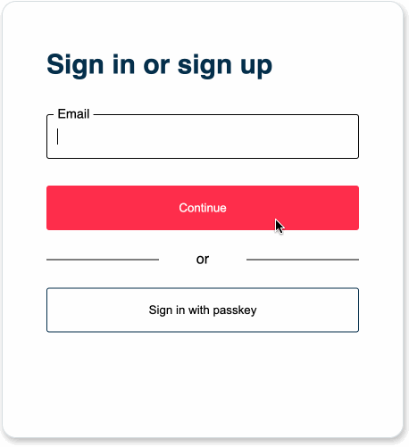

# &lt;hanko-auth&gt; element

The `<hanko-auth>` element offers a complete user interface that will bring a modern
login and registration experience to your users. It integrates the [Hanko API](../backend/README.md),
a backend that provides the underlying functionalities.

## Features

* Registration and login flows with and without passwords
* Passkey authentication
* Passcodes, a convenient way to recover passwords and verify email addresses
* Language support for English and German

## Upcoming Features

* Customizable UI styles
* Support for Security Keys
* Exponential backoff mechanisms
* Testing and code documentation

## Installation

_WiP_

## Usage

### Script

Import as a modules:

_WiP_

With a script tag via CDN:

_WiP_

### Markup

```html
<hanko-auth api="https://hanko.yourdomain.com" lang="en" />
```

Please take a look at the [Hanko API](../backend/README.md) to see how to spin up the backend.

Note that we're working on Hanko Cloud, so that you don't need to run the Hanko API by yourself and all you need is to
do is adding the `<hanko-auth>` element to your page.

## Attributes

- `api` the location where the Hanko API is running.
- `lang` Currently supported values are "en" for English and "de" for German. If the value is omitted, "en" is used.

## Events

Events are dispatched on the `<hanko-auth>` element. These events do not bubble.

- `success` - Login or registration completed successfully and a JWT has been issued. You can now take control and redirect the user to protected pages.

```js
const hanko = document.querySelector('hanko-auth')

hanko.addEventListener('success', () => {
    hanko.parentElement.innerHTML = 'secured content...'
})
```

## Demo

The animation below demonstrates how user registration with passwords enabled looks like. You can set up the flow you
like using the [Hanko API](../backend/README.md) configuration file. The registration flow also includes email
verification via passcodes and the registration of a passkey so that the user can log in without passwords or passcodes.



## Browser support

- Chrome
- Firefox
- Safari
- Microsoft Edge

## License

The hanko-auth element is licensed under the [MIT License](LICENSE).
